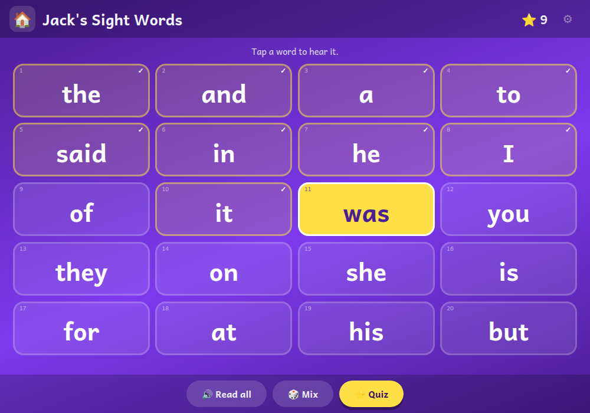

# 👀 Jack's Sight Words

**The twenty most common English words on twenty big cards — tap one and hear it read out**

[](https://jacks-games.github.io/sight-words/)




## What this is

Some English words cannot be sounded out. *Said* is not *s-a-i-d*, *was* is not *w-a-s*, and
*the* helps nobody who tries. Year 1 calls them **sight words**: you learn them by seeing them,
not by decoding them, and once they are in place a page of a first reading book is suddenly
mostly words you already know.

This is that list, on cards. The twenty are the top of the DfE **"first 100 high frequency
words"** — the order schools in England actually use — so the small number in the corner of
each card is its rank, and card 1 is the word he will meet most often of all:

> the · and · a · to · said · in · he · I · of · it · was · you · they · on · she · is · for · at · his · but

Tap a card and the word is read out in the same neural English voice the other games use. The
card lights up yellow, keeps a ✓, and counts towards the twenty stars in the corner. Nothing
is ever locked, nothing is ever wrong: he can tap the same word forty times if he likes it.

## 🎮 How to play

### 👆 &nbsp; Tap a word to hear it
The card flashes yellow, the word is spoken, and a ✓ says he has read it. Twenty ticks and
the whole screen celebrates: *"You can read all twenty words!"*

### 🔊 &nbsp; Read all
Walks the list from the top, lighting each card as it says it, with a breath in between.
Tap anything to stop it.

### 🎲 &nbsp; Mix
Shuffles the cards. Children are very good at learning *"the one in the top left corner"*
instead of the word, and this takes that away. Tap again to put them back in order.

### ⭐ &nbsp; Quiz
Ten rounds. *"Find the word: said."* Tap the right card and it lights up with confetti; tap a
wrong one and it just wobbles and says *"try again"* — the round stays open until he gets it.

## 🎯 What it practises

- 👀 &nbsp; Recognising the twenty words that make up a large share of every early reading book
- 👂 &nbsp; Hearing each one said properly in English, as often as he wants
- 🧠 &nbsp; Word, not position — "Mix" makes sure the grid cannot be memorised instead

## ⚙️ How it works

Twenty `<button>` cards in a CSS grid: four across on a tablet, three on a phone, in
[Andika](https://fonts.google.com/specimen/Andika) so the **a** and the **g** are shaped the
way school writes them. Which words have been read is a comma-separated list in
`localStorage` (`jackSightRead`), so the ticks survive closing the tab.

**The voice is not the browser's.** Web Speech sounds like a computer on an iPhone, which Jack
noticed straight away, so every line — all twenty words and every prompt — is pre-rendered as
a small MP3 with Microsoft's neural `en-GB-SoniaNeural` voice and played back through Web
Audio. The page fetches a manifest of `text -> file` at load; anything not in it falls back to
`speechSynthesis`, so the game never goes silent. The `AudioContext` is created inside the ▶
tap, because iOS refuses to start audio any other way.

## 🎈 The other games

| Game | What it is | |
|---|---|---|
| 📖 [**Jack's Words**](https://github.com/jacks-games/words) | Hear a word, build it from letter tiles, then read it in a sentence | [▶ play](https://jacks-games.github.io/words/) |
| 🥅 [**Jack's Match**](https://github.com/jacks-games/match) | Tell real words from decodable nonsense words, then spell by ear | [▶ play](https://jacks-games.github.io/match/) |
| ✏️ [**Jack's Letters**](https://github.com/jacks-games/letters) | Finger-trace all 26 lowercase letters in the correct stroke order | [▶ play](https://jacks-games.github.io/letters/) |
| 🔢 [**Jack's Numbers**](https://github.com/jacks-games/numbers) | Count, add and subtract with footballs — to 10, then to 20 | [▶ play](https://jacks-games.github.io/numbers/) |
| 💯 [**Jack's Big Numbers**](https://github.com/jacks-games/big-numbers) | Tens and ones, adding and taking away all the way to 100 | [▶ play](https://jacks-games.github.io/big-numbers/) |
| 🍎 [**Jack's Apples**](https://github.com/jacks-games/apples) | Trace 1–20, then fill the missing numbers into the apple grid | [▶ play](https://jacks-games.github.io/apples/) |
| 👀 [**Jack's Sight Words**](https://github.com/jacks-games/sight-words) | The twenty most common English words on big cards — tap one and hear it read out | [▶ play](https://jacks-games.github.io/sight-words/)  👈 **this one** |
| ♟️ [**Jackies Schach**](https://github.com/jacks-games/chess) | Full FIDE rules with a coach that marks the safe squares (German) | [▶ play](https://jacks-games.github.io/chess/) |

All eight on one start page: **[jackbenn.ing](https://jackbenn.ing)** — homework games first, chess always last.

## 🛠 Built like this

Every game in this organisation is **one self-contained `index.html`** — no build step, no
framework, no package manager, no analytics, and no network calls once the page and its clips
have loaded. That is a deliberate constraint: a game a child depends on should still work in
five years, and a parent should be able to read the whole thing in one sitting.

- **Speech** — pre-rendered neural clips through Web Audio, with the Web Speech API as the
  fallback. It always waits for a tap first, because Chrome and iOS block audio without user
  activation.
- **Progress** — kept in `localStorage` on the device. Nothing is collected, sent or stored
  anywhere else.
- **Made for** an iPad mini in either orientation: finger-sized targets, no hover-only
  interactions, `prefers-reduced-motion` respected.

Run it locally:

```bash
python3 -m http.server 8000
```

The start page at [jackbenn.ing](https://jackbenn.ing) is built from
[google814/Jack](https://github.com/google814/Jack), which is the source of truth. The repos
in this organisation are copies kept in step by `tools/sync-game-repos.sh` in that repo, so
each game also has its own page and its own link.
